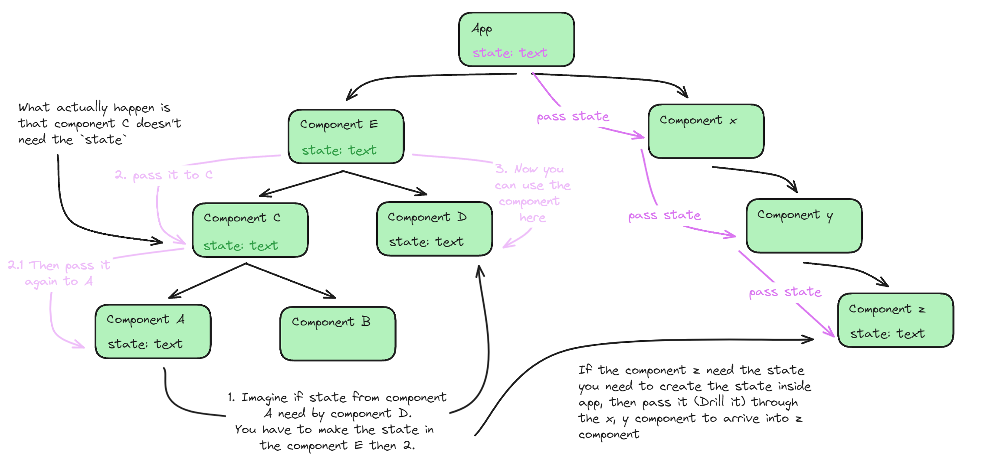
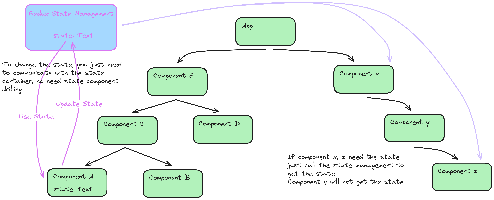
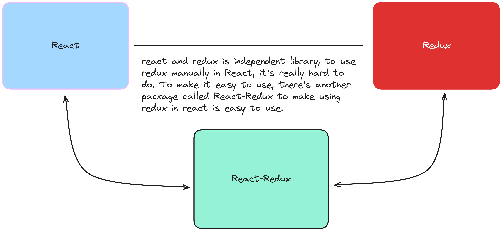

# Redux Introduction

## Prerequisites

Fundamental of React

## Redux

"Redux is predictable state container for JavaScript"

1. "It is for JavaScript apps"
2. "It is a state container"
3. "It is predictable"

### Redux is for JavaScript App

- Redux is not tied to `React`.
- Can be used with React, Angular, Vue or Vanila JavaScript.
- Redux is library for JavaScript Application

### Redux is a state container

> - Redux store the `state` of your application  
> - State of an app is the `state` represented by all the individual components of
    that app.
> - Redux store and manage the application state.

Consider a React app - `state` of a component.

Example

`State` of `LoginFormComponent`

```JavaScript
state = {
    username: '',
    password: '',
    submitting: false
}
```

`state` of `userListComponent`

```JavaScript
state = {
    user: []
}
```

`state` of Application

```JavaScript
state = {
    isUserLoggedIn: true,
    username: 'fatah',
    profileUrl: '',
    onlineUsers: [],
    isModalOpened: false
}
```

### Redux is Predictable

1. Redux is a state container
2. state in application can change

Example case:  

- Todo list app -> item(pending) -> item (completed). 

In Redux, all state transition are explicit and it is possible to keep track of 
them. -> state changin becomes predictable. 

## React + Redux

- why react with redux?
- react has own state in their component, why we need another tools to manage it?

### State in React App

> You can't pass `state` from child component to parent component.

In order to manipulate that, you can use schema of "Create the state in the 
parent componet, the manipulate the state in the children by passing the setter
function to the child component"

`parent.jsx`
```jsx
function Parent(){
    const data_from_child = (data) => {
        console.log(`data from child: ${data}`)
    }

    return (
        <Child setter={data_from_child} /> // pass setter to the child component
    )
}
```

`child.jsx`
```jsx
function Child({ setter }){
    setter("data from child");
    return (<></>)
}
```

Imagine if you have a condition of:



If you have a considerable number of components which share some common `state`,
**State Management** could become a big trouble.

### The Redux Way to Manage the State



### Do we really have the problem?

- `React` already have `React Context`. This will prevent you for `prop` drilling
  and pass the `prop` only for the needed component.
- You also think `useContext + useReducer` also have the ability that Redux offer

The reason for Redux is `Redux 1.0` is realease on August 2015 while `React Context`
still not available.

## React Redux Package

> `React-Redux` is the official Redux UI binding library for React.

React and Redux is completely different library package. It is very hard to 
use Redux inside React. Therefor we need `react-redux` package to make it easy
to use Redux inside React.

React-Redux provides couple of function to make us able to connect React application
with redux. So if you use `Redux` inside `React`, you need `React-Redux` to bind
within the two library.



## Summary

- `React` library for UI
- `Redux` library for managing state of JavaScript application
- `React-Redux` is library that provides binding to use `React` and `Redux` 
  together in the application.

## Important to note

- Don't learn `React` and `Redux` at the same time.
- Is `React` using redux still relevant? `useContext` and `useReducer` can replace
  what `Redux` can do.
- Still you learn redux if the lifetime of redux is short?  
  Learn Redux still relevant for building the logical thinking of props
- Should redux added to all React app?  
  Just when you find your self strugling manage the state of the app, use Redux.
- Redux has learning curve.

# Course Structure

- First half, just Redux
- Then, how to bind redux concept to React application


